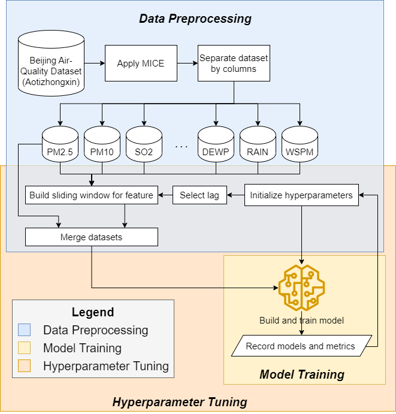
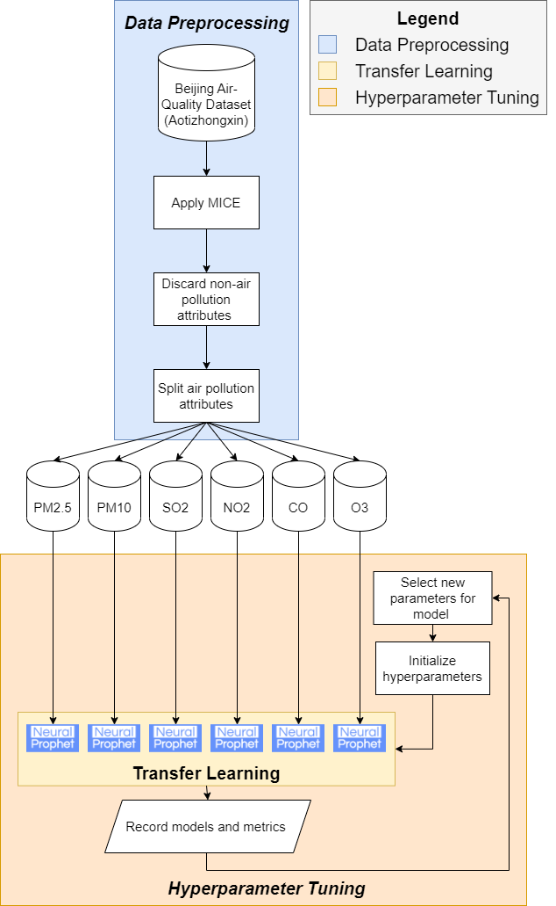
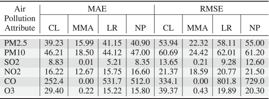
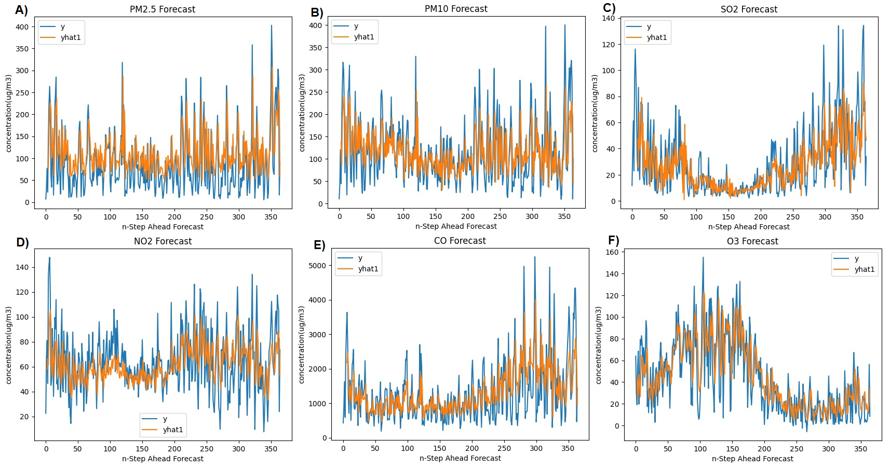

# Explainable Long-Term Forecasting of Air Pollution

This repository contains code associated with the paper titled "[Explainable Long-Term Forecasting of Air Pollution](https://ieeexplore.ieee.org/document/10386580)" presented in [5th International Workshop on Big Data Analytics for Sustainability (BDA4S)](https://bda4s.github.io/2023.html) of [IEEE Big Data 2023](http://bigdataieee.org/BigData2023/) conference in Sorrento, Italy.


# Data 

Dataset location: [Dataset](https://archive.ics.uci.edu/ml/datasets/Beijing+Multi-Site+Air-Quality+Data)!

The data processing pipeline without the use of Neural Prophet is shown below:
 

The pipline for data processing with Neural Propher is given shown below:



# Results

Table below show the comparsion of RMSE and MAE for each Airpolution attribute with the Compositional Learning (CL) and Meta-Learning Approach (MMA) for the newly tested Linear Regression (LR) and Neural Prophet (NP) models:


The forecast of NP can be seen below:

The accuracy over long term was noticed to be high for NP.


# License

Licensing details are provided [here](LICENSE).
> You are NOT allowed to make any unauthorized copy of the code


# Contact

If you have any questions, please get in touch with us at: `mutakabbir@cmail.carleton.ca`.


## Citation / Referencing 

```
@INPROCEEDINGS{10386580,
  author={Mutakabbir, Abdul and Ajila, Samuel A.},
  booktitle={2023 IEEE International Conference on Big Data (BigData)}, 
  title={Explainable Long-Term Forecasting of Air Pollution}, 
  year={2023},
  pages={3794-3802},
  doi={10.1109/BigData59044.2023.10386580}
}
```
